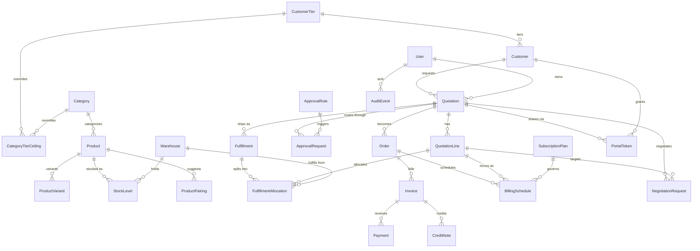

# Architecture

One idea drives every screen: **rules are data, and one set of pure functions computes every
number that appears anywhere in the product.** The API, the customer portal, and the deal-health
dashboard are three different surfaces reading through the same core — none of them re-derives a
price, a risk score, or an anomaly independently.

## The shared core: `backend/app/engine/*`

Every module here is a pure function — dataclasses in, dataclasses out, no database access, no
side effects. This is deliberate: it's the only way three different callers (API request
handlers, the seed script, the portal) can be guaranteed to get the same number for the same
input, and it's why every number on screen can be explained — each function returns its
reasoning alongside its result.

| Module | Computes |
|---|---|
| `pricing.py` | Line and order totals, margin, blended/peak discount overage — **the** pricing function; nothing else computes a total |
| `ceilings.py` | Which discount ceiling applies (tier base → category default → explicit override) |
| `risk.py` | The risk band and its per-line breakdown, from the pricing output |
| `routing.py` | Which approval steps a quotation needs, from risk + rule rows in the database |
| `fulfillment.py` | Warehouse allocation splits and backorders from stock levels |
| `billing.py` | Invoice line items from shipped quantities, subscription proration to the day |
| `upsell.py` | Cross-sell suggestions ranked by co-purchase score and margin impact |
| `anomaly.py` | Stalled deals, discount anomalies (z-score vs. rep baseline), delivery slippage |

Config that would normally be a constant is instead a row: discount ceilings
(`category_tier_ceilings`), approval thresholds (`approval_rules`), and dashboard thresholds
(`system_settings`, editable from the Settings screen) are all read at call time, not compiled in.

## Surfaces that read through the core

```
┌─────────────────┐     ┌──────────────────┐     ┌────────────────────┐
│   Internal app   │     │  Customer portal  │     │   Deal Health /     │
│  (reps, manager,  │     │ (own schema, own  │     │  Reports dashboard  │
│  finance, admin)  │     │  token auth, own  │     │                      │
│                   │     │  route tree)      │     │                      │
└─────────┬─────────┘     └─────────┬─────────┘     └──────────┬──────────┘
          │                          │                          │
          └──────────────┬───────────┴──────────────┬───────────┘
                          ▼                          ▼
                 backend/app/engine/*       backend/app/models/audit.py
                 (pricing, risk, routing,      (append-only AuditEvent —
                  fulfillment, billing,         every state change writes
                  upsell, anomaly)              here; dashboard, audit
                                                 trail, and anomaly
                                                 detector all read it)
                          │
                          ▼
                     PostgreSQL
```

The portal never imports internal API code — it has its own Pydantic DTOs and its own router
(`app/api/portal.py`), so it is structurally incapable of leaking cost, margin, or risk data. It
authenticates with an opaque token hashed at rest, not a JWT, scoped to a single quotation.

The append-only `audit_events` table is the single source of truth for three separate features:
the audit trail on a quotation, the "last action" column on the Deal Health dashboard, and the
before/after comparison when a discount ceiling changes and approved quotations flip back into
the approval queue.

## Entity-relationship model



## What's demo-critical (never cut)

The risk engine and its per-line breakdown, automatic approval routing, the append-only audit
trail, the separately-tokenized customer portal, rules stored as data, shipment-driven invoicing,
and automatic re-entry into approval after a customer negotiation. Everything else — multi-
currency, the optional admin reporting screen, product variants beyond one attribute — is
additive and can be trimmed under time pressure without touching what makes this different from
a quote-to-invoice form.
