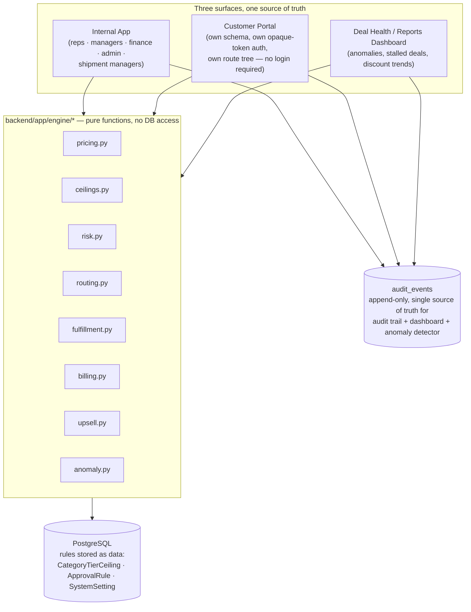
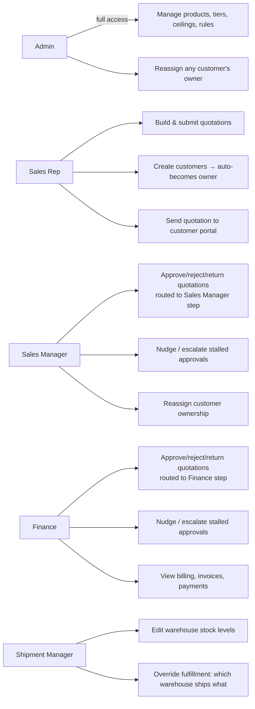
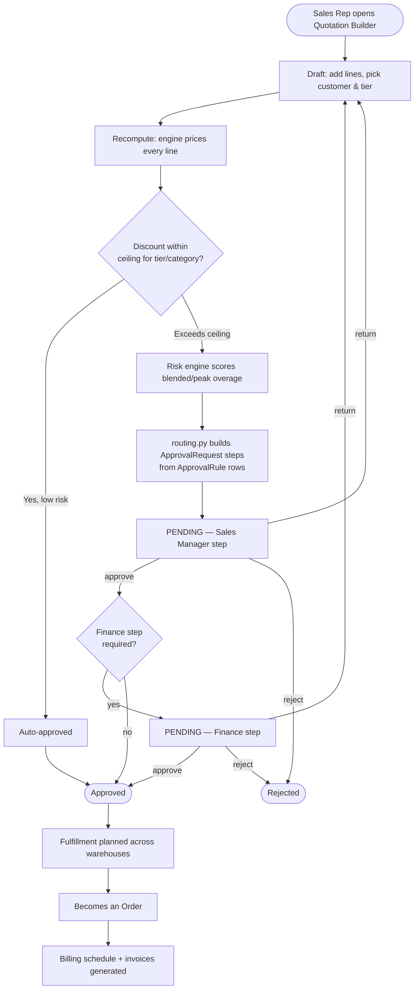
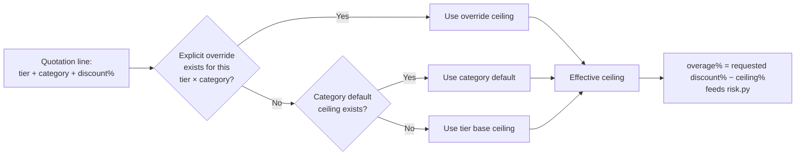
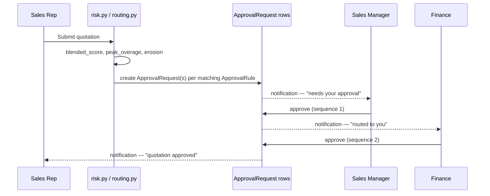
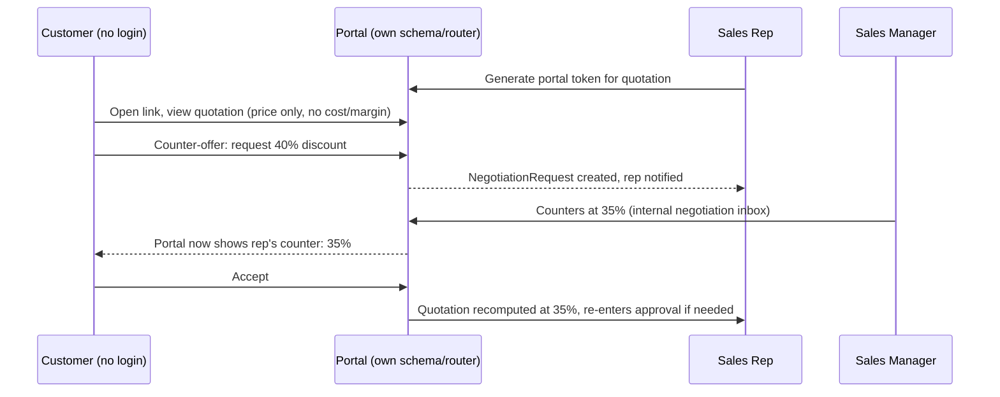
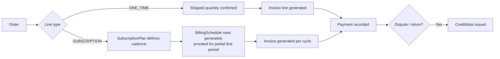
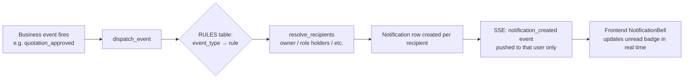

# DealFlow360

A **quote-to-cash platform that governs itself**. Pricing, discount ceilings, approval routing,
warehouse allocation, hybrid billing, and deal-health anomaly detection are all driven by one
pricing engine and business rules stored **as data** — never hardcoded thresholds buried in code.

Three surfaces — the internal app, a token-based customer negotiation portal, and a deal-health
dashboard — all read through the same core engine, so a price, a risk score, or an anomaly is
computed exactly once no matter who's looking at it.

---

## Table of contents

- [Quick start](#quick-start)
- [Demo credentials](#demo-credentials)
- [System architecture](#system-architecture)
- [Roles & permissions](#roles--permissions)
- [Core functionality](#core-functionality)
  - [1. Quotation lifecycle](#1-quotation-lifecycle)
  - [2. Pricing & discount ceilings](#2-pricing--discount-ceilings)
  - [3. Risk scoring & approval routing](#3-risk-scoring--approval-routing)
  - [4. Customer negotiation portal](#4-customer-negotiation-portal)
  - [5. Fulfillment & warehouse allocation](#5-fulfillment--warehouse-allocation)
  - [6. Hybrid billing (one-time + subscription)](#6-hybrid-billing-one-time--subscription)
  - [7. Upsell & cross-sell](#7-upsell--cross-sell)
  - [8. Deal health & anomaly detection](#8-deal-health--anomaly-detection)
  - [9. In-app notifications](#9-in-app-notifications)
  - [10. Customer ownership](#10-customer-ownership)
- [Data model](#data-model)
- [Standing engineering rules](#standing-engineering-rules)
- [Roadmap](#roadmap)

---

## Quick start

Requires Docker and Docker Compose.

```bash
docker compose up --build
```

- Frontend: http://localhost:5173
- Backend API: http://localhost:8000/api (interactive docs at http://localhost:8000/docs)
- Postgres: localhost:5433 (mapped from the container's 5432 to avoid clashing with a local install)

First boot creates the schema automatically but does not seed data:

```bash
docker compose exec backend python -m app.seed
```

### Reset to a clean demo state

```bash
docker compose exec backend python -m app.seed --reset
```

Drops every table, recreates the schema, and reseeds ~15–20 historical quotations, products,
customers, warehouses (with a deliberately split stock level), subscription plans, product
pairings, and approval rules. Takes about 2 seconds — run this right before a demo.

### Run the backend test suite

```bash
docker compose exec backend pytest -q
```

---

## Demo credentials

All internal accounts share the password below. Each role sees a different set of screens and
permissions — log in as each to see the full flow.

| Role | Email | Password |
|---|---|---|
| Admin | `admin@dealflow360.com` | `password123` |
| Sales Rep | `rep@dealflow360.com` | `password123` |
| Sales Rep (2) | `rep2@dealflow360.com` | `password123` |
| Sales Rep (3, high-discount outlier) | `rep3@dealflow360.com` | `password123` |
| Sales Manager | `manager@dealflow360.com` | `password123` |
| Finance | `finance@dealflow360.com` | `password123` |
| Shipment Manager | `shipment@dealflow360.com` | `password123` |

`rep3` is seeded with a consistently higher discount pattern than the other reps, so their
quotes are the ones the anomaly detector on the Deal Health dashboard (`/deal-health`) flags out
of the box.

---

## System architecture



Every module in `/engine` is a pure function — dataclasses in, dataclasses out, no database
access, no side effects. This guarantees three different callers (API handlers, the seed script,
the portal) always get the same number for the same input, and it's why every number on screen
can be explained: each function returns its reasoning alongside its result.

| Module | Computes |
|---|---|
| `pricing.py` | Line and order totals, margin, blended/peak discount overage |
| `ceilings.py` | Which discount ceiling applies: override → category default → tier base |
| `risk.py` | Risk band and per-line breakdown, from the pricing output |
| `routing.py` | Which approval steps a quotation needs, from risk + `ApprovalRule` rows |
| `fulfillment.py` | Warehouse allocation splits and backorders from stock levels |
| `billing.py` | Invoice line items from shipped quantities, subscription proration to the day |
| `upsell.py` | Cross-sell suggestions ranked by co-purchase score and margin impact |
| `anomaly.py` | Stalled deals, discount anomalies (z-score vs. rep baseline), delivery slippage |

The portal never imports internal API code — it has its own Pydantic DTOs and its own router, so
it is structurally incapable of leaking cost, margin, or risk data. See
[`ARCHITECTURE.md`](ARCHITECTURE.md) for the full entity-relationship diagram.

---

## Roles & permissions



Key rule: a quotation's **owner cannot approve their own quotation** — enforced on both backend
and frontend — with one self-correcting exception: if the required role currently has only a
single holder (e.g. only one Finance user exists), that person may approve their own quotation so
the deal isn't permanently stuck. The exception disables itself automatically the moment a second
person is given that role.

---

## Core functionality

### 1. Quotation lifecycle



Every recompute (e.g. after a ceiling change or a negotiated discount) **re-evaluates risk from
scratch** — an already-approved quotation can flip back into the approval queue if the new
numbers cross a threshold. This is deliberate: approvals always reflect current numbers, never a
stale snapshot.

### 2. Pricing & discount ceilings

Ceiling resolution follows a strict precedence — **the most specific rule always wins**:



All ceilings, tier bases, and category defaults are rows in `CategoryTierCeiling` / customer
tiers, editable from the Settings screen — never a Python or TypeScript constant.

### 3. Risk scoring & approval routing

`risk.py` computes a **blended score** (weighted average overage across all lines) and a **peak
overage** (the single worst line), plus a total margin-erosion amount. `routing.py` matches these
against `ApprovalRule` rows (role + threshold + sequence) to decide which approval steps a
quotation needs — zero, one (Sales Manager), or two (Sales Manager → Finance).



Stuck approvals can be **nudged** (reminder, logged to audit) or **escalated** (raises priority,
notifies the next level) — restricted to Sales Manager / Finance / Admin, never the quotation's
own rep.

### 4. Customer negotiation portal

A rep clicks **Send to Customer** on a quotation to generate a link:

```
http://localhost:5173/portal/<opaque-token>
```

The token is a random secret **hashed at rest**, scoped to a single quotation, expiring after 14
days (configurable). No login required — and no cost, margin, or risk data is ever sent to this
surface (verify by inspecting the network tab while using the portal).



### 5. Fulfillment & warehouse allocation

On approval, `fulfillment.py` splits each line's quantity across warehouses by available stock,
flagging any shortfall as a backorder.

```mermaid
flowchart TD
    Approved([Quotation approved]) --> Plan[ensure_fulfillment_planned]
    Plan --> Check{Enough stock<br/>in one warehouse?}
    Check -->|Yes| Single[Allocate fully from<br/>nearest/highest-stock warehouse]
    Check -->|No| Split[Split across multiple warehouses]
    Split --> Short{Still short?}
    Short -->|Yes| Backorder[Remaining qty → BACKORDER]
    Short -->|No| Planned([Fulfillment: PLANNED])
    Single --> Planned
    Backorder --> Planned
    Planned --> ShipMgr[Shipment Manager can override:<br/>which warehouse ships what]
    ShipMgr --> Shipped([Fulfillment: shipped → feeds billing]))
```

Recomputing a quotation (e.g. after a ceiling change) invalidates any stale `PLANNED`
fulfillment and re-plans it against the new line quantities.

### 6. Hybrid billing (one-time + subscription)

A single quotation can mix **one-time** lines (billed on shipment) and **subscription** lines
(billed on a recurring schedule, prorated to the day for partial periods).



### 7. Upsell & cross-sell

`upsell.py` ranks `ProductPairing` rows by co-purchase score and margin impact, surfacing
suggestions in the Quotation Builder as a line is added — e.g. adding Product A suggests Product
B if the two are frequently bought together and B carries healthy margin.

### 8. Deal health & anomaly detection

`anomaly.py` reads the append-only `audit_events` table (the same table backing every audit
trail) to compute three signals surfaced on `/deal-health`:

- **Stalled deals** — quotations sitting in one state past a configurable window.
- **Discount anomalies** — a rep's discount pattern more than N standard deviations from the
  team baseline (z-score) — this is what flags `rep3`'s quotes out of the box.
- **Delivery slippage** — shipments running behind the fulfillment plan.

### 9. In-app notifications

A centralized dispatcher (`core/notifications.py`) maps business events to recipient-resolution
rules, so notification logic never scatters across routers:



Covers: submitted for approval, routed to next approver, approved, rejected, returned for
revision, recomputed & re-entered approval, auto-approved, and negotiation events. No email/SMTP
— in-app only, reusing the existing SSE broadcaster.

### 10. Customer ownership

```mermaid
flowchart TD
    RepCreate[Sales Rep creates a customer] --> AutoOwner[Auto-becomes owner_user_id<br/>— cannot be overridden by the rep]
    AutoOwner --> UseIt[Any rep can still build quotations<br/>for this customer]
    UseIt --> OtherRep{A different rep<br/>selects this customer?}
    OtherRep -->|Yes| Warn[Non-blocking warning:<br/>"already owned/worked by X"]
    Warn --> Proceed[Rep proceeds anyway if needed]
    OtherRep -->|No| Normal[Normal flow]
    Reassign[Manager/Admin] -->|can reassign| AutoOwner
```

Ownership conflicts surface real data via a warning callout rather than hard-blocking the
action — consistent with how negotiation re-entry and other soft-guardrails work elsewhere in the
app.

---

## Data model

See [`ARCHITECTURE.md`](ARCHITECTURE.md) for the full entity-relationship diagram covering
products, warehouses, quotations, approvals, fulfillment, billing, and the portal.

---

## Standing engineering rules

- **One pricing function** — if a number appears in two places, it came from the same call
  (`app/engine/pricing.py`).
- Every engine function returns its explanation alongside its result.
- Every state change writes an audit event (`app/models/audit.py`).
- **Config is data** — discount ceilings, approval thresholds, anomaly thresholds, and
  stalled-deal windows are all rows in the database, editable from the Settings screen, never
  Python or TypeScript constants.
- Money is `Decimal` throughout the backend; the frontend never does money arithmetic itself.
- Timestamps are stored in UTC and formatted at the edge.

---

## Roadmap

- Multi-currency and multi-company support
- ML-ranked upsell trained on real co-purchase history, not seeded pairing scores
- Contract lifecycle and renewal management
- ERP / accounting system connectors
- Approval SLA escalation (auto-escalate a stuck approval after N hours)
- Mobile approvals
- Email notifications alongside the existing in-app system
